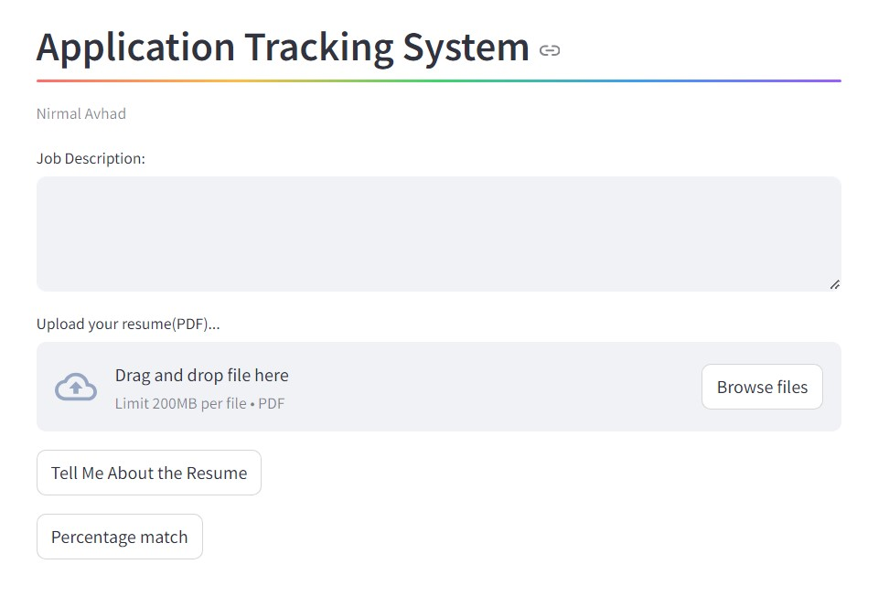
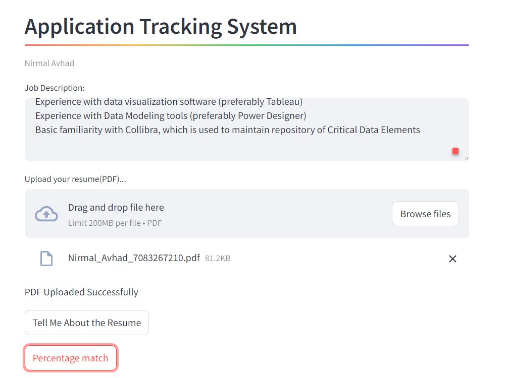
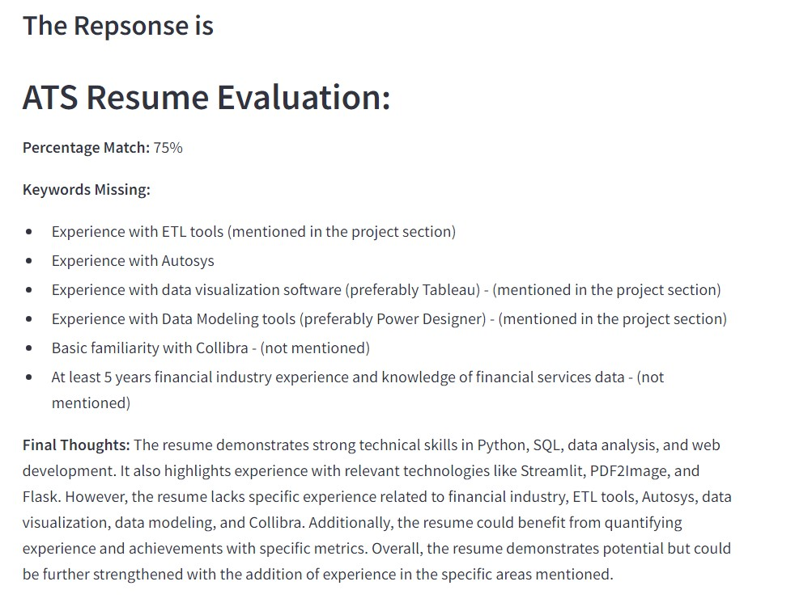

# Application Tracking System

Welcome to the Application Tracking System project! This platform is designed to help candidates evaluate their resumes against job descriptions, providing detailed feedback on strengths, missing keywords, and resume matching scores.

## Features

- **Resume Strength Analysis**: Get insights into the strengths of your resume based on the job description.
- **Keyword Matching**: Identify missing keywords that are crucial for the job role.
- **Resume Matching Score**: Receive a score indicating how well your resume matches the job description.

## Technologies Used

- **Python**: The core programming language used for the backend.
- **Gen AI (Gemini-1.5 Fast)**: Employed for generating insights and feedback.
- **PIL (Python Imaging Library)**: Used for image processing tasks.
- **Streamlit**: A framework for building the web application interface.

## Installation

1. Clone the repository:
    ```bash
    git clone https://github.com/luci1113/ATS.git
    cd application-tracking-system
    ```

2. Create a virtual environment and activate it:
    ```bash
    python -m venv venv
    source venv/bin/activate  # On Windows, use `venv\Scripts\activate`
    ```

3. Install the required dependencies:
    ```bash
    pip install -r requirements.txt
    ```

## Usage

1. Run the Streamlit application:
    ```bash
    streamlit run app.py
    ```

2. Open your web browser and go to `http://localhost:8501` to access the Application Tracking System.
---




Feel free to modify this README as needed for your specific project details and requirements.
